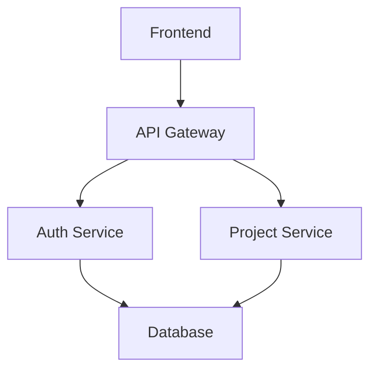

# Architecture Diagrams

Visual representations of the system architecture, data flows, and infrastructure.

## Purpose

This directory will contain diagrams to help understand:
- System architecture
- Microservices interactions
- Network topology
- Data flows
- Deployment architecture
- Security architecture

## What Will Go Here

When created, this directory will include:

### 1. High-Level Architecture
- **architecture-overview.md** - Complete system overview
- **deployment-architecture.md** - Deployment topology
- **network-architecture.md** - Network design

### 2. Microservices Diagrams
- **microservices-overview.md** - Service interactions
- **service-communication.md** - API calls and messaging
- **data-flow.md** - How data moves through the system

### 3. Infrastructure Diagrams
- **aws-infrastructure.md** - AWS resources and connections
- **ubuntu-infrastructure.md** - Ubuntu server setup
- **kubernetes-architecture.md** - K8s cluster layout

### 4. Security Diagrams
- **security-layers.md** - Security architecture
- **network-security.md** - Firewall rules, security groups
- **authentication-flow.md** - Auth and authorization flows

### 5. Data Diagrams
- **database-schema.md** - Entity relationship diagrams
- **data-architecture.md** - Data storage strategy
- **backup-recovery.md** - Backup and DR topology

## Diagram Tools

Recommended tools for creating diagrams:

### ASCII Art (Text-Based)
```
┌─────────────┐
│   Frontend  │
└──────┬──────┘
       │
┌──────▼──────┐
│ API Gateway │
└──────┬──────┘
       │
   ┌───┴───┐
   ▼       ▼
┌─────┐ ┌─────┐
│Auth │ │ DB  │
└─────┘ └─────┘
```

### Mermaid (Markdown Diagrams)


### Draw.io / Diagrams.net
- Free, web-based
- Export to PNG, SVG, PDF
- Good for complex diagrams

### Lucidchart
- Professional tool
- Collaboration features
- AWS architecture icons

### PlantUML
- Code-based diagrams
- Great for version control
- Many diagram types

### Excalidraw
- Hand-drawn style
- Simple and intuitive
- Web-based

## Example Diagram Structure

```
diagrams/
├── README.md (this file)
│
├── architecture/
│   ├── overview.md
│   ├── microservices.md
│   └── deployment.md
│
├── infrastructure/
│   ├── aws-production.md
│   ├── ubuntu-dev.md
│   └── network-topology.md
│
├── security/
│   ├── security-layers.md
│   ├── auth-flow.md
│   └── network-security.md
│
├── data/
│   ├── database-schema.md
│   ├── data-flow.md
│   └── backup-strategy.md
│
└── images/
    ├── architecture-overview.png
    ├── aws-infrastructure.png
    └── ... (exported diagram images)
```

## Sample Architecture Diagram

```
┌──────────────────────────────────────────────────────────────────────┐
│                         USER LAYER                                    │
├──────────────────────────────────────────────────────────────────────┤
│  Web Browser  │  Mobile App  │  API Clients  │  Third-party Apps    │
└────────┬──────┴──────┬───────┴──────┬────────┴───────────┬───────────┘
         │             │              │                    │
         └─────────────┴──────────────┴────────────────────┘
                                │
                    ┌───────────▼──────────┐
                    │   CDN (CloudFront)   │
                    └───────────┬──────────┘
                                │
                    ┌───────────▼──────────┐
                    │    Load Balancer     │
                    └───────────┬──────────┘
                                │
         ┌──────────────────────┼──────────────────────┐
         │                      │                      │
    ┌────▼────┐          ┌──────▼──────┐       ┌──────▼──────┐
    │Frontend │          │ API Gateway │       │  WebSocket  │
    │ Service │          │   (Kong)    │       │   Service   │
    └─────────┘          └──────┬──────┘       └─────────────┘
                                │
         ┌──────────────────────┼──────────────────────┐
         │                      │                      │
    ┌────▼────┐          ┌──────▼──────┐       ┌──────▼──────┐
    │  Auth   │          │  Project    │       │   Audit     │
    │ Service │          │  Service    │       │  Service    │
    └────┬────┘          └──────┬──────┘       └──────┬──────┘
         │                      │                      │
         └──────────────────────┴──────────────────────┘
                                │
                    ┌───────────▼──────────┐
                    │   PostgreSQL + Redis │
                    └──────────────────────┘
```

## When to Create Diagrams

Create diagrams when:
- ✅ Explaining architecture to stakeholders
- ✅ Onboarding new team members
- ✅ Planning infrastructure changes
- ✅ Documenting for compliance
- ✅ Troubleshooting system issues

## Diagram Best Practices

### 1. **Keep It Simple**
- One concept per diagram
- Don't try to show everything
- Use appropriate level of detail

### 2. **Use Consistent Notation**
- Stick to one diagramming style
- Use standard symbols
- Define custom symbols in legend

### 3. **Label Everything**
- Clear component names
- Show relationships
- Add annotations for clarity

### 4. **Update Regularly**
- Keep diagrams in sync with code
- Version diagrams with code
- Mark diagrams with "Last Updated" date

### 5. **Make It Accessible**
- Use color-blind friendly colors
- Provide text alternatives
- Export to multiple formats

## Current Status

**Status:** Empty - Diagrams not yet created

**Create diagrams when:**
- Presenting to stakeholders
- Documenting architecture decisions
- Training new team members
- Planning major changes

**Priority diagrams to create first:**
1. High-level architecture overview
2. Microservices interaction diagram
3. Database schema
4. Deployment topology
5. Security architecture

---

**Last Updated:** 2025-11-02
**Status:** Placeholder - Awaiting diagram creation

## Useful Resources

- **Mermaid Documentation:** https://mermaid.js.org/
- **PlantUML:** https://plantuml.com/
- **Draw.io:** https://www.diagrams.net/
- **Excalidraw:** https://excalidraw.com/
- **AWS Architecture Icons:** https://aws.amazon.com/architecture/icons/
- **C4 Model:** https://c4model.com/ (diagram framework)
